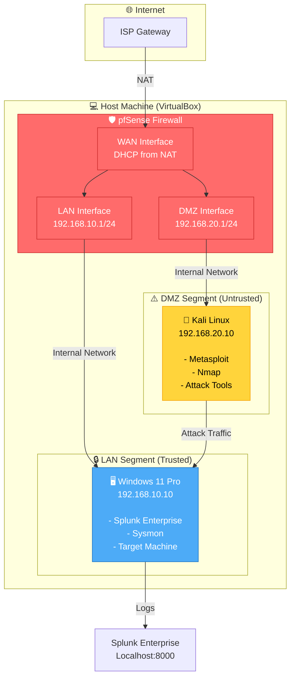

# Network Architecture Diagram

## Complete Network Topology

## Security Zones

| Zone | Network | Purpose | Access Control |
|------|---------|---------|----------------|
| **Internet (WAN)** | DHCP (NAT) | External Access | Controlled by pfSense |
| **LAN** | 192.168.10.0/24 | Trusted Network | Full access to internet |
| **DMZ** | 192.168.20.0/24 | Untrusted Network | Restricted access to LAN |

## Firewall Rules Matrix

| Source | Destination | Protocol | Port | Action | Purpose |
|--------|------------|----------|------|--------|---------|
| DMZ | Any | ICMP | - | Allow | ICMP Testing |
| DMZ | LAN | Any | Any | Allow | Kali → Windows |
| DMZ | Any | Any | Any | Allow | Internet Access |
| DMZ | Firewall | TCP | 443 | Block | Block Management |
| LAN | Any | Any | Any | Allow | Internet Access |
| Any | Any | Any | Any | Block | Default Deny |
